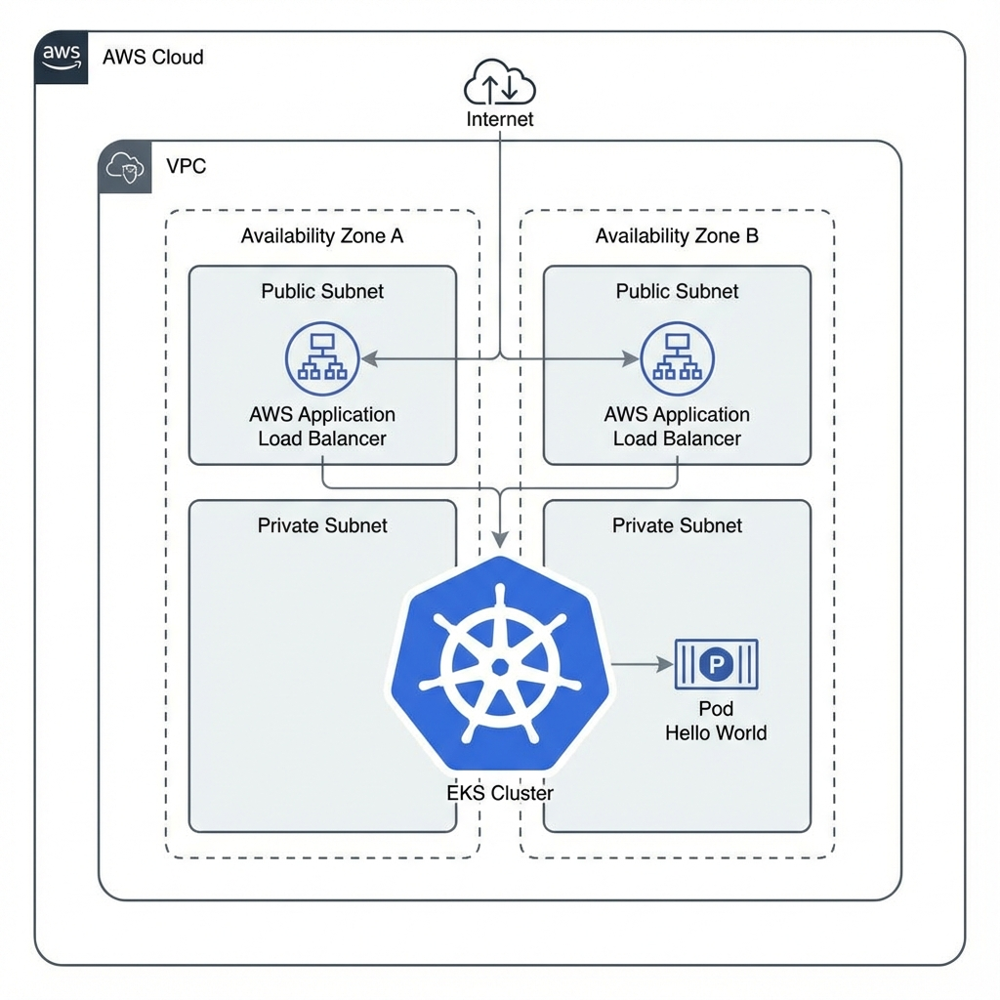

# Handytec DevOps Challenge


This repository contains the solution for the Handytec DevOps Challenge. It includes Infrastructure as Code (IaC) for deploying a Kubernetes cluster on AWS using Terraform, a Helm deployment for a sample application, and a Bash script for system monitoring.


## 📒 Index

- [About](#-about)
- [Usage](#-usage)
- [Installation](#-installation)
- [Commands](#-commands)
- [Development](#-development)
- [Pre-Requisites](#-pre-requisites)
- [Development Environment](#-development-environment)
- [File Structure](#-file-structure)
- [Build](#-build)
- [Deployment](#-deployment)
- [Community](#-community)
- [Contribution](#-contribution)
- [Branches](#-branches)
- [Guideline](#-guideline)
- [FAQ](#-faq)
- [Resources](#-resources)
- [Gallery](#-gallery)
- [Credit/Acknowledgment](#-creditacknowledgment)
- [License](#-license)

## 🔰 About
This project demonstrates a complete DevOps workflow including:
1.  **Infrastructure Provisioning**: Using Terraform to create a VPC and EKS cluster on AWS.
2.  **Application Deployment**: Using Helm to deploy the `nginxdemos/hello` container.
3.  **System Monitoring**: A Bash script to check service status, memory usage, and disk space on AlmaLinux.

## ⚡ Usage
The project is divided into two main parts: Infrastructure (Terraform) and Monitoring (Bash).

### Infrastructure
Navigate to the `terraform` directory to manage the AWS infrastructure.

### Monitoring
Run the `scripts/monitor.sh` script on your Linux server to get a health report.

## 🔌 Installation

### Terraform & AWS
1.  Install [Terraform](https://developer.hashicorp.com/terraform/downloads).
2.  Install [AWS CLI](https://aws.amazon.com/cli/).
3.  Configure AWS credentials: `aws configure`.

### Bash Script
1.  Ensure you have a Bash shell (standard on Linux).
2.  Make the script executable: `chmod +x scripts/monitor.sh`.

## 📦 Commands

### Terraform
```bash
cd terraform
terraform init
terraform plan
terraform apply
```

### Monitoring Script
```bash
./scripts/monitor.sh
```

## 🔧 Development
Contributions are welcome to improve the infrastructure code or the monitoring script.

## 📓 Pre-Requisites
-   **Terraform**: v1.0+
-   **AWS CLI**: v2+
-   **Kubectl**: Compatible with EKS 1.27
-   **Bash**: v4+

## 🔩 Development Environment
1.  Clone the repository:
    ```bash
    git clone git@github.com:marizemh/handytec_challenge.git
    cd handytec_challenge
    ```
2.  Install dependencies as listed in Pre-Requisites.

## 📁 File Structure
```
.
├── assets
│   └── infrastructure_diagram.png
├── scripts
│   └── monitor.sh
├── terraform
│   ├── main.tf
│   ├── variables.tf
│   ├── outputs.tf
│   └── helm.tf
└── README.md
```

| No | File Name | Details |
|----|-----------|---------|
| 1 | main.tf | Main Terraform config for VPC and EKS |
| 2 | helm.tf | Helm provider and release config |
| 3 | monitor.sh | Bash script for system monitoring |

## 🔨 Build
No build step is required for the Terraform code. The Docker image is pulled from Docker Hub.

## 🚀 Deployment
Deployment is handled via Terraform. Running `terraform apply` will:
1.  Create the VPC.
2.  Create the EKS Cluster.
3.  Deploy the "Hello World" application using Helm.

## 🌸 Community
Join the Handytec community for support and discussions.

## 🔥 Contribution
Your contributions are always welcome!
-   **Report a bug**: Open an issue.
-   **Request a feature**: Open an issue.
-   **Create a pull request**: Fork the repo, create a feature branch, and submit a PR.

## 🌵 Branches
-   `master`: Production branch.
-   `stage`: Development branch.
-   `feat-*`: Feature branches.

## ❗ Guideline
-   Follow HCL best practices for Terraform.
-   Follow ShellCheck guidelines for Bash scripts.

## ❓ FAQ
**Q: Can I use this on Azure?**
A: This specific configuration is for AWS.

## 📄 Resources
-   [Terraform EKS Module](https://registry.terraform.io/modules/terraform-aws-modules/eks/aws/latest)
-   [Helm Provider](https://registry.terraform.io/providers/hashicorp/helm/latest)

## 📷 Gallery


## 🌟 Credit/Acknowledgment
Developed by Marizé Mijares Hernández for the Handytec Challenge.

## 🔒 License
MIT License.
