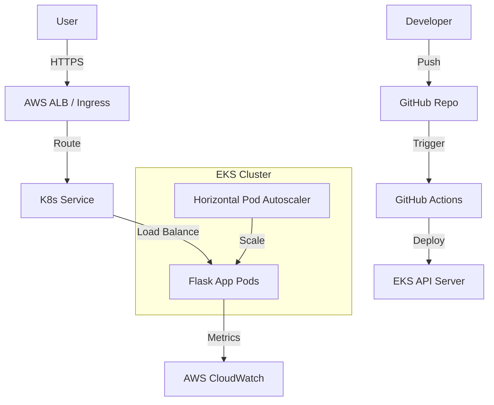

# System Architecture

## Overview
The solution is designed to be cloud-agnostic (initially AWS) and highly scalable.

## Security
- **Network Policies**: Restrict pod-to-pod communication.
- **IAM Roles (IRSA)**: Pods use least-privilege IAM roles.
- **Secrets Management**: K8s Secrets (could be integrated with AWS Secrets Manager).

## Scalability
- **HPA**: auto-scales pods based on CPU/Memory.
- **CA (Cluster Autoscaler)**: auto-scales worker nodes based on pending pods.
